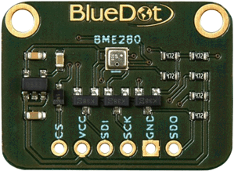
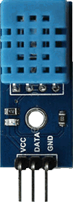
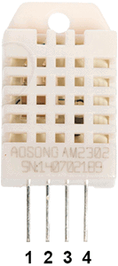
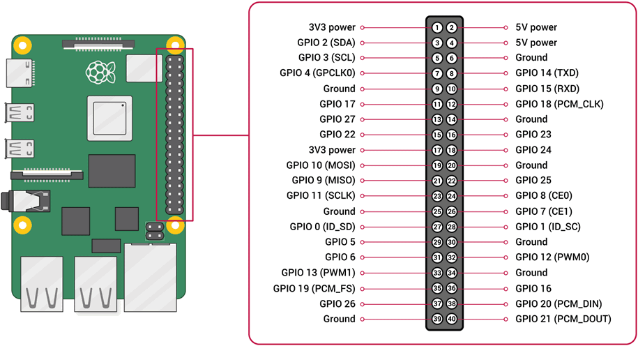

# snraspi.EnvironmentSensors

Module EnvironmentSensors encapsulates access to different physical sensors into a class which allows common access to sensor data from Raspberry Pi, independently from the device type.

The module uses different [Adafruit](https://www.adafruit.com/) CircuitPython libraries for device access.
See <https://circuitpython.org/>.
For CircuitPython on Raspberry Pi, see <https://learn.adafruit.com/circuitpython-on-raspberrypi-linux/installing-circuitpython-on-raspberry-pi>

The following sensors are currently supported:

- BME280 with I2C bus
- BME280 with SPI bus
- DHT11 with 1-wire bus
- DHT22 with 1-wire bus

## Usage

```python
from snraspi.sensors import EnvironmentSensor
...
#
# Activate line according to configured environment
# For DHT11 and DHT22, specify the 1-wire pin in board notation PINnn
# The pin selection, specified below, is the one used in the tests in ./tests/sensors
#
sensor = EnvironmentSensor.EnvironmentSensorBME280_I2C()
#sensor = EnvironmentSensor.EnvironmentSensorBME280_SPI(EnvironmentSensor.PIN29)
#sensor = EnvironmentSensor.EnvironmentSensorDHT11(EnvironmentSensor.PIN11)
#sensor = EnvironmentSensor.EnvironmentSensorDHT22(EnvironmentSensor.PIN13)
...
temperature = sensor.temperature
humidity = sensor.humidity
pressure = sensor.pressure
altitude = sensor.altitude
```

## Sensor Connection to Raspberry Pi

### BME280 with I2C Bus

#### Raspberry Pi Configuration I2C

In Raspberry Pi Configuration / Interfaces activate I2C

As a result, in ```/boot/config.txt```, the following line is active:
```dtparam=i2c_arm=on```

#### Wiring BME280 with I2C



The following table specifies Raspberry Pi pins PINnn in BOARD notation

| BME280  | Raspberry Pi Pin |
|---------|------------------|
| CS      | PIN01  - 3.3V    |
| VCC/VIN | PIN01  - 3.3V    |
| SDI     | PIN03  - SDA     |
| SCK     | PIN05  - SCL     |
| GND     | PIN09  - GND     |
| SDO     | --               |

### BME280 with SPI Bus

#### Raspberry Pi Configuration SPI

In Raspberry Pi Configuration / Interfaces activate SPI

As a result, in ```/boot/config.txt```, the following line is active:
```dtparam=spi=on```

#### Wiring BME280 with SPI


The following table specifies Raspberry Pi pins PINnn in BOARD notation

| BME280  | Raspberry Pi Pin |
|---------|------------------|
| CS      | PINnn  - GPIOxx  |
| VCC/VIN | PIN01  - 3.3V    |
| SDI     | PIN19  - MOSI    |
| SCK     | PIN23  - SCLK    |
| GND     | PIN09  - GND     |
| SDO     | PIN21  - MISO    |

Choose a free Chip Select (CS) pin.
the test module test_BME280_SPI.py uses PIN29 (GPIO 5)

### DHT11 with 1-wire bus

See <https://learn.adafruit.com/dht/dht-circuitpython-code>

#### Raspberry Pi Configuration 1-wire for DHT11

In Raspberry Pi Configuration / Interfaces activate 1-Wire.
This will specify PIN07 (GPIO 4) as 1-wire data pin.

In order to specify a different pin, enter/activate the following line in ```/boot/config.txt```:
 ```dtoverlay=w1-gpio, gpiopin=xx```
where xx is the GPIO "Pin number (BCM)" of the intended pin (see [Mapping BOARD to BCM Pin Numbers](#mappingboardtobcmpinnumbers), below)

For example, for PIN11, you need to configure ```dtoverlay=w1-gpio, gpiopin=17```

#### Wiring DHT11



The following table specifies Raspberry Pi pins in board notation

| DHT11   | Raspberry Pi Pin |
|---------|------------------|
| VCC     | PIN01  - 3.3V    |
| DATA    | PINnn  - GPIOxx  |
| GND     | PIN09  - GND     |

In the EnvironmentSensor interfaces, you need to specify the DATA pin through ```EnvironmentSensor.PINxx``` with xx from column "Pin Number (BOARD)"

### DHT22 with 1-wire bus

See <https://learn.adafruit.com/dht/dht-circuitpython-code>

#### Raspberry Pi Configuration 1-wire for DHT22

In Raspberry Pi Configuration / Interfaces activate 1-Wire.
This will specify PIN07 (GPIO 4) as 1-wire data pin.

In order to specify a different pin, enter/activate the following line in ```/boot/config.txt```:
```dtoverlay=w1-gpio, gpiopin=xx```
where xx is the GPIO "Pin number (BCM)" of the intended pin (see [Mapping BOARD to BCM Pin Numbers](#mappingboardtobcmpinnumbers), below)

For example, for PIN13, you need to configure ```dtoverlay=w1-gpio, gpiopin=27```

#### Wiring DHT22



The following table specifies Raspberry Pi pins in board notation

| DHT22   | Raspberry Pi Pin |
|---------|------------------|
| 1 VCC   | PIN01  - 3.3V    |
| 2 DATA  | PINnn  - GPIOxx  |
| 3 N.C.  | --               |
| 4 GND   | PIN09  - GND     |

There needs to be a pull-up resistor of 10k between DATA and VCC.

In the EnvironmentSensor interfaces, you need to specify the DATA pin through ```EnvironmentSensor.PINxx``` with xx from column "Pin Number (BOARD)"

## Mapping BOARD to BCM Pin Numbers


See <https://www.raspberrypi.org/documentation/usage/gpio/>

EnvorinmentSensor uses BOARD notation PINnn for pin identification.
In the interfaces, pins need to be identified through ```EnvironmentSensor.PINnn``` according to the able below:

| Pin Number (BOARD) | Pin ID (BCM) | Pin Number (BCM) |
|--------------------|--------------|------------------|
| PIN03              | GPIO 2       | 2                |
| PIN05              | GPIO 3       | 3                |
| PIN07              | GPIO 4       | 4                |
| PIN08              | GPIO 14      | 14               |
| PIN10              | GPIO 15      | 15               |
| PIN11              | GPIO 17      | 17               |
| PIN12              | GPIO 18      | 18               |
| PIN13              | GPIO 27      | 27               |
| PIN15              | GPIO 22      | 22               |
| PIN16              | GPIO 23      | 23               |
| PIN18              | GPIO 24      | 24               |
| PIN19              | GPIO 10      | 10               |
| PIN21              | GPIO 9       | 9                |
| PIN22              | GPIO 25      | 25               |
| PIN23              | GPIO 11      | 11               |
| PIN24              | GPIO 8       | 8                |
| PIN26              | GPIO 7       | 7                |
| PIN27              | GPIO 0       | 0                |
| PIN28              | GPIO 1       | 1                |
| PIN29              | GPIO 5       | 5                |
| PIN31              | GPIO 6       | 6                |
| PIN32              | GPIO 12      | 12               |
| PIN33              | GPIO 13      | 13               |
| PIN35              | GPIO 19      | 19               |
| PIN36              | GPIO 16      | 16               |
| PIN38              | GPIO 20      | 20               |
| PIN40              | GPIO 21      | 21               |
